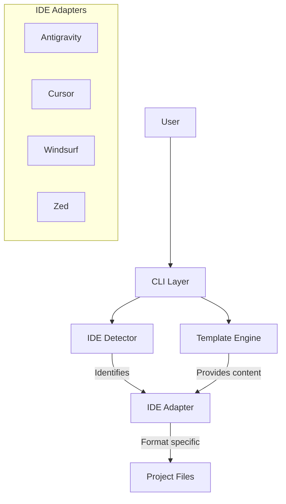

# Architecture

AGEN is designed as a modular, stateless CLI tool that acts as a bridge between high-quality AI prompts and your development environment.

## High-Level Overview



## Core Components

### 1. CLI Layer (`internal/cli`)
Built with [Cobra](https://github.com/spf13/cobra), this layer handles argument parsing, flag management, and user interaction. It delegates actual logic to the core modules.

- **Root**: Global flags and setup.
- **TUI**: Uses [Bubble Tea](https://github.com/charmbracelet/bubbletea) for the interactive wizard(`agen init`).

### 2. IDE Abstraction (`internal/ide`)
AGEN uses an Adapter pattern to support multiple IDEs. Each IDE implementation must satisfy the `Adapter` interface:

```go
type Adapter interface {
    Name() string
    Detect(projectPath string) bool
    Install(tmpl *Templates, opts InstallOptions) error
    Update(tmpl *Templates, opts UpdateOptions) (*UpdateChanges, error)
}
```

- **Antigravity**: Writes to `.agent/` directory (Native format).
- **Cursor**: Concatenates content into `.cursorrules`.
- **Windsurf**: Concatenates content into `.windsurfrules`.
- **Zed**: Writes to `.zed/prompts/` and settings.

### 3. Template Engine (`internal/templates`)
Templates are embedded directly into the Go binary using `embed`. This ensures the tool is offline-capable and zero-dependency.

- **Parsing**: Metadata is extracted from YAML frontmatter in Markdown files.
- **Filtering**: Allows selecting subsets of agents/skills.
- **Data**: Stored in `internal/templates/data/`.

### 4. Profile Management
Profiles are serialized configurations stored in JSON format in the user's config directory (`~/.config/agen/profiles` or equivalent).

## Directory Structure

| Directory | Purpose |
|-----------|---------|
| `cmd/agen` | Main entry point |
| `internal/cli` | Command implementations |
| `internal/ide` | IDE detection and installation logic |
| `internal/templates` | Template loading and parsing |
| `internal/templates/data` | Raw markdown template files |
| `internal/tui` | Terminal UI components |
