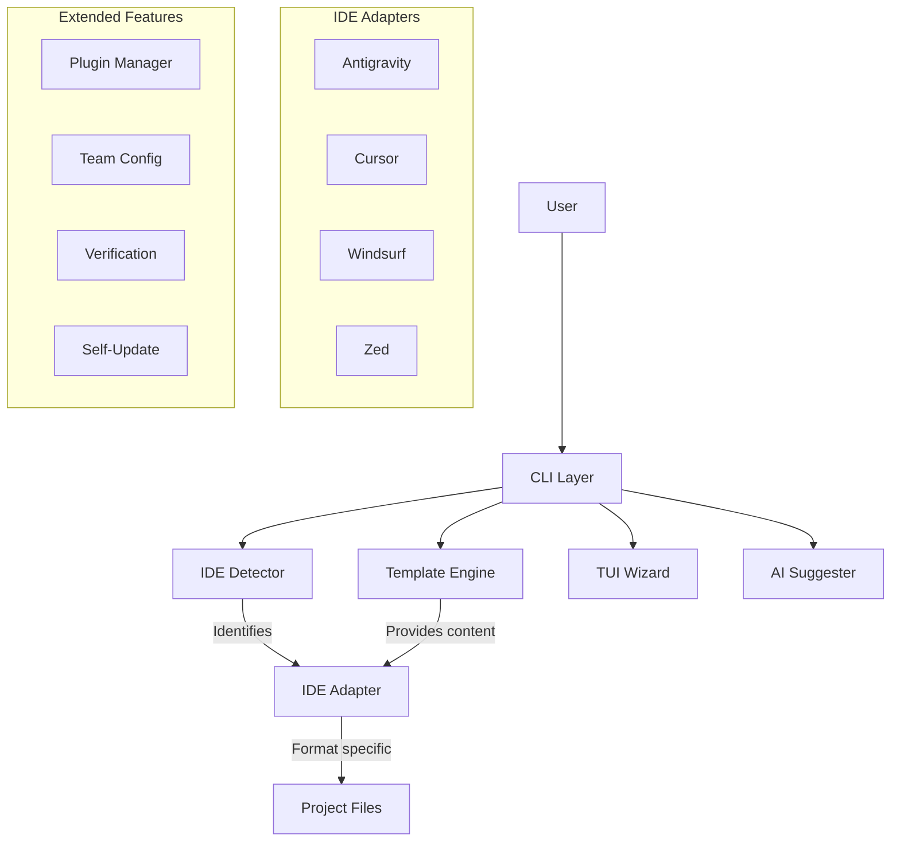
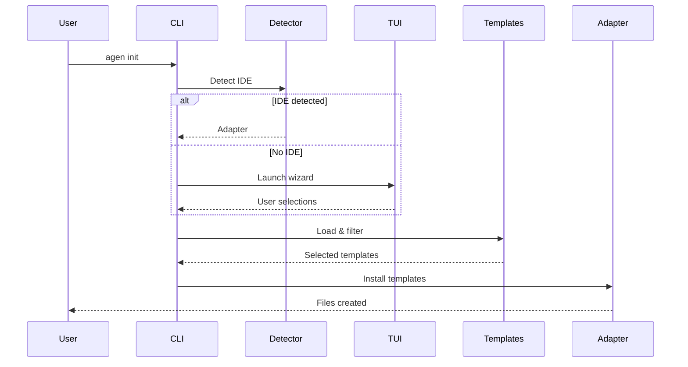

# Architecture

AGEN is designed as a modular, stateless CLI tool that acts as a bridge between high-quality AI prompts and your development environment.

## High-Level Overview



---

## Core Components

### 1. CLI Layer (`internal/cli`)

Built with [Cobra](https://github.com/spf13/cobra), this layer handles argument parsing, flag management, and user interaction.

| File | Purpose |
|------|---------|
| `root.go` | Base command, global flags, subcommand registration |
| `init.go` | `agen init` - template installation |
| `list.go` | `agen list` - template listing |
| `status.go` | `agen status` - installation status |
| `health.go` | `agen health` - project health dashboard |
| `search.go` | `agen search` - fuzzy search |
| `update.go` | `agen update` - template updates |
| `upgrade.go` | `agen upgrade` - binary self-update |
| `verify.go` | `agen verify` - verification runner |
| `profile.go` | `agen profile` - profile management |
| `team.go` | `agen team` - team collaboration |
| `plugin.go` | `agen plugin` - plugin management |
| `ai.go` | `agen ai` - AI features |
| `create.go` | `agen create` - custom templates |
| `remote.go` | `agen remote` - remote sources |

---

### 2. IDE Abstraction (`internal/ide`)

AGEN uses an **Adapter pattern** to support multiple IDEs. Each IDE implementation satisfies the `Adapter` interface:

```go
type Adapter interface {
    Name() string
    Detect(projectPath string) bool
    Install(tmpl *Templates, opts InstallOptions) error
    Update(tmpl *Templates, opts UpdateOptions) (*UpdateChanges, error)
    GetRulesPath() string
}
```

| Adapter | File | Target |
|---------|------|--------|
| **AntigravityAdapter** | `antigravity.go` | `.agent/` directory |
| **CursorAdapter** | `cursor.go` | `.cursorrules` file |
| **WindsurfAdapter** | `windsurf.go` | `.windsurfrules` file |
| **ZedAdapter** | `zed.go` | `.zed/prompts/` |

**Detection** (`detector.go`):
- Scans for IDE-specific marker files
- Returns appropriate adapter or nil
- Priority: Cursor > Windsurf > Zed > Antigravity

---

### 3. Template Engine (`internal/templates`)

Templates are embedded directly into the Go binary using `go:embed`.

| File | Purpose |
|------|---------|
| `embedded.go` | Template loading, parsing, installation |
| `data/agents/*.md` | 20 agent templates |
| `data/skills/*/SKILL.md` | 36 skill templates |
| `data/workflows/*.md` | 8 workflow templates |

**Key Operations:**
- **LoadEmbedded()**: Loads all templates from embedded FS
- **Filter()**: Selects specific agents/skills
- **InstallTo()**: Writes templates to target directory

**Template Format:**
```markdown
---
name: agent-name
description: Brief description
skills: skill1, skill2
tools: Read, Write, Edit
---

# Agent Content

System prompt and behavioral instructions...
```

---

### 4. TUI Wizard (`internal/tui`)

Interactive terminal UI built with [Bubble Tea](https://github.com/charmbracelet/bubbletea).

| Component | Purpose |
|-----------|---------|
| `wizard.go` | Main wizard flow |
| `model.go` | TUI state model |
| `views.go` | Screen renderers |
| `styles.go` | Lipgloss styling |

**Wizard Steps:**
1. IDE Selection (if not detected)
2. Agent Selection (multi-select)
3. Skill Selection (multi-select)
4. Confirmation

---

### 5. AI Suggester (`internal/ai`)

Analyzes projects and provides intelligent recommendations.

```go
type Suggester struct {
    templates *Templates
}

func (s *Suggester) Suggest(projectDir string) ([]Suggestion, error)
func (s *Suggester) ExplainSkill(name string) (string, error)
func (s *Suggester) Compose(name, description string, baseAgents []string) (*ComposedAgent, error)
```

**Analysis Factors:**
- Package manager files (package.json, go.mod, requirements.txt)
- Framework detection
- Directory structure
- Configuration files

---

### 6. Verification Runner (`internal/verify`)

Runs automated checks on projects.

```go
type Runner struct {
    projectPath string
    options     RunnerOptions
}

func (r *Runner) RunSecurity() Result    // Security scanning
func (r *Runner) RunLint() Result        // Code quality
func (r *Runner) RunUX() Result          // Accessibility/UX
func (r *Runner) RunSEO() Result         // SEO checks
```

---

### 7. Plugin Manager (`internal/plugin`)

Manages plugin installation and lifecycle.

```go
type Manager struct {
    pluginDir string
    registry  *Registry
}

func (m *Manager) Install(source string) (*Plugin, error)
func (m *Manager) Uninstall(name string) error
func (m *Manager) List() []*Plugin
func (m *Manager) Create(name, pluginType string) (string, error)
```

**Supported Sources:**
- GitHub repositories
- Local file paths
- HTTP/HTTPS URLs

---

### 8. Team Configuration (`internal/team`)

Handles shared team configurations.

```go
type TeamConfig struct {
    Name           string            `json:"name"`
    RequiredAgents []string          `json:"required_agents"`
    RequiredSkills []string          `json:"required_skills"`
    LockedVersions map[string]string `json:"locked_versions"`
    Settings       TeamSettings      `json:"settings"`
}

func (tc *TeamConfig) Sync(projectDir string) (*SyncResult, error)
func (tc *TeamConfig) Validate(projectDir string) (*ValidationResult, error)
```

---

### 9. Global Configuration (`internal/config`)

Manages user preferences and global settings.

```go
type Config struct {
    AnalyticsEnabled bool   `json:"analytics_enabled"`
    AutoCheckUpdates bool   `json:"auto_check_updates"`
    DefaultIDE       string `json:"default_ide"`
    CacheDir         string `json:"cache_dir"`
}
```

**Storage Locations:**
- Linux: `~/.config/agen/config.json`
- macOS: `~/Library/Application Support/agen/config.json`
- Windows: `%APPDATA%\agen\config.json`

---

### 10. Self-Updater (`internal/updater`)

Handles binary self-updates from GitHub releases.

```go
type Updater struct {
    currentVersion string
    githubRepo     string
}

func (u *Updater) Check() (*Release, error)
func (u *Updater) Update(release *Release) error
```

---

## Directory Structure

| Directory | Purpose |
|-----------|---------|
| `cmd/agen` | Main entry point |
| `internal/cli` | Command implementations (18 files) |
| `internal/ide` | IDE adapters (5 files) |
| `internal/templates` | Template engine + embedded data |
| `internal/templates/data` | 64 template files |
| `internal/tui` | Terminal UI wizard |
| `internal/ai` | AI suggester |
| `internal/verify` | Verification runner |
| `internal/plugin` | Plugin manager |
| `internal/team` | Team configuration |
| `internal/config` | Global configuration |
| `internal/updater` | Self-update logic |
| `docs` | MkDocs documentation |

---

## Data Flow

### Initialization Flow



---

## Dependencies

| Package | Purpose |
|---------|---------|
| `github.com/spf13/cobra` | CLI framework |
| `github.com/charmbracelet/bubbletea` | TUI framework |
| `github.com/charmbracelet/lipgloss` | Terminal styling |
| `github.com/fatih/color` | Colored output |
| `github.com/sahilm/fuzzy` | Fuzzy search |
| `gopkg.in/yaml.v3` | YAML parsing |
| `github.com/fsnotify/fsnotify` | File watching |

---

## Design Principles

1. **Stateless**: No daemon, no server, just a CLI tool
2. **Offline-First**: Embedded templates work without network
3. **IDE-Agnostic**: Adapter pattern for multiple IDEs
4. **Zero Config**: Works out-of-box with sensible defaults
5. **Extensible**: Plugin system for custom extensions
