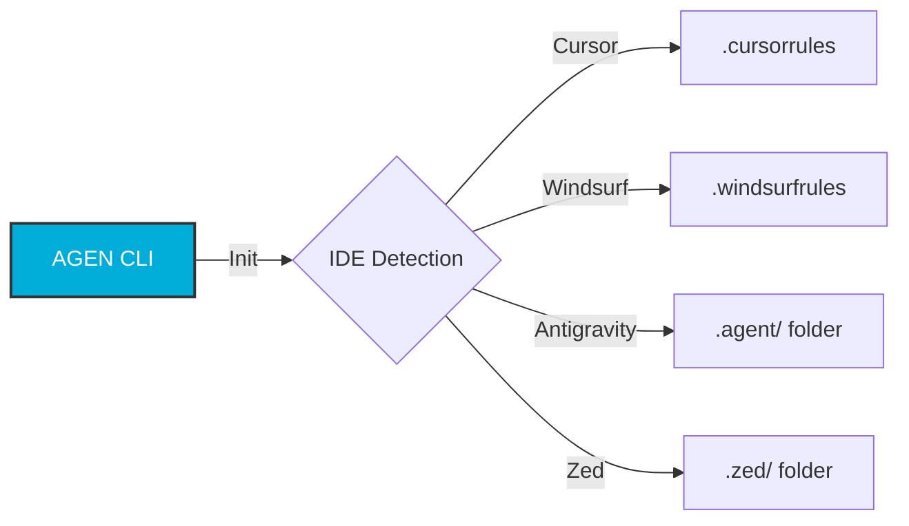

---
hide:
  - navigation
---

# AGEN

<div align="center">


**The Universal AI Agent Manager**

[](https://golang.org)
[](LICENSE)
[](https://github.com/eshanized/agen/releases)

[Get Started](getting-started.md){ .md-button .md-button--primary }
[View Commands](commands.md){ .md-button }

</div>

---

## What is AGEN?

**AGEN** (Agent Generation Engine) is the missing link between your AI coding assistant and your project's needs. It manages **Agent Templates**—structured prompts, skills, and workflows—and adapts them to your specific IDE.

Whether you use **Cursor**, **Windsurf**, **Antigravity**, or **Zed**, AGEN ensures your AI assistant behaves exactly how you need it to.

<div class="grid cards" markdown>

-   :material-robot: **20+ Specialist Agents**
    From Frontend Experts to Security Auditors, switch personas instantly.

-   :material-puzzle: **Modular Skills**
    Mix and match capabilities like Docker, React, or Penetration Testing.

-   :material-laptop: **Multi-IDE Support**
    One configuration, tailored output for Cursor, Windsurf, Zed, and more.

-   :material-check-decagram: **Health & Verify**
    Ensure your project's agent configuration is valid and up-to-date.

</div>

## How it Works



## Quick Start

1.  **Install**
    ```bash
    brew install eshanized/tap/agen
    ```

2.  **Initialize**
    ```bash
    cd my-project
    agen init
    ```

3.  **Code**
    Open your IDE. Your AI assistant now knows exactly how to behave.

## Why use AGEN?

!!! quote "The Problem"
    Every AI IDE has a different way of configuring "System Prompts" or "Rules". Sharing these configurations across teams or projects is a manual, error-prone mess of copy-pasting markdown files.

!!! success "The AGEN Solution"
    AGEN treats AI prompts as **dependencies**. You define *what* you need ("Frontend Agent" + "Tailwind Skill"), and AGEN compiles it for *where* you work.
