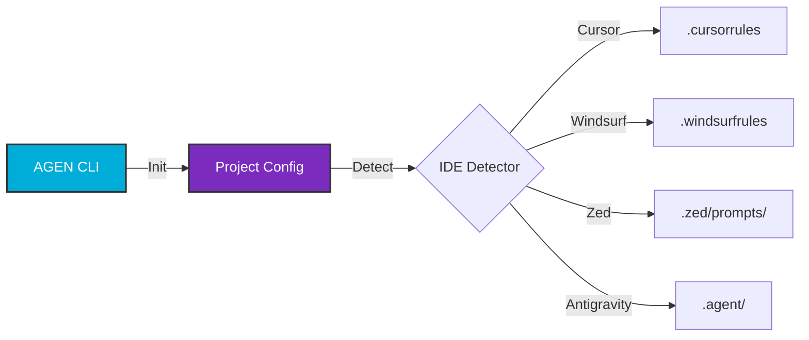

---
hide:
  - navigation
  - toc
---

# 
 { width="200" style="margin-bottom: 1rem;" }   AGEN 

  <h2 style="margin-top: 0; font-weight: 300;">The Universal AI Agent Manager</h2>
  

    Standardize, share, and manage your AI coding assistants across any IDE.
    One CLI to rule them all.
  

   

  [Get Started](getting-started.md){ .md-button .md-button--primary style="padding: 12px 24px; font-size: 1.1rem;" }
  [View Commands](commands.md){ .md-button style="padding: 12px 24px; font-size: 1.1rem; margin-left: 10px;" }

   

-   :material-robot: **20+ Specialist Agents**
    
    From Frontend Experts to Security Auditors, switch personas instantly with a single command. `agen init` does the heavy lifting.

-   :material-puzzle: **Modular Skills**

    Mix and match capabilities like Docker, React, or Penetration Testing. Agents are composable and reusable across projects.

-   :material-laptop: **Multi-IDE Support**

    One configuration, tailored output for **Cursor**, **Windsurf**, **Zed**, and **Antigravity**. Never write a system prompt manually again.

-   :material-check-decagram: **Health & Verify**

    Ensure your project's agent configuration is valid, secure, and up-to-date with `agen verify`.

  

## How it Works

## Why use AGEN?

AI coding assistants are powerful, but managing their "system prompts" (or personalities) is a mess.
You copy-paste text files, lose track of versions, and struggle to share successful prompts with your team.

**AGEN** solves this by treating Agent Templates like packages. 

> "It's like `npm` for your AI's personality."
